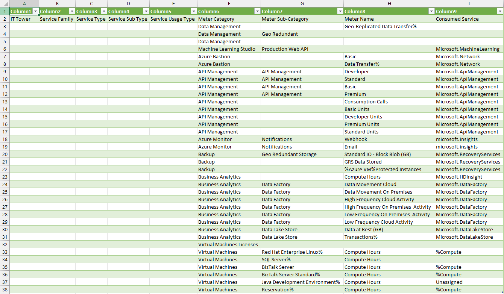
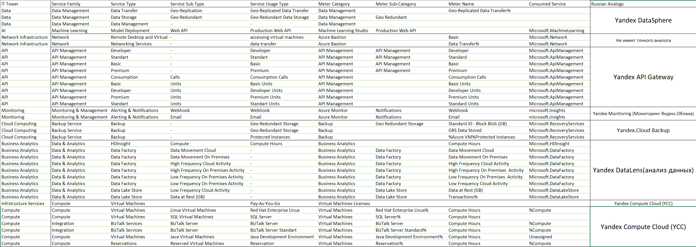

description: "I am perfectly suited for this environment." - Tinker
---
# Отчёт Аналитическая лабораторная работа №2 "Azure"

## Состав команды
* Холод Виолетта https://t.me/maybevilou
* Сергеев Артём https://t.me/imrreyz
* Морозов Матвей 	https://t.me/jkkgmr
* Копытко Александр https://t.me/monegasquee

## Цель работы
Изучение облачных сервисов с целью овладения основными принципами. Акцентирование внимания на понимании уровней абстракции, предоставляемых над инфраструктурой в облачной среде. Освоение различных типов потребления сервисов в контексте сервисной модели. Проведение сопоставления между сервисами различных облачных провайдеров для выявления аналогий и особенностей.

## Дано
1. Слепок данных биллинга от провайдера после небольшой обработки в виде SQL-параметров. 
2. Google с документациями провайдера

## Исходные данные

### Ход работы:

# Описание встретившихся сервисов Azure

## Data Management (Управление данными): 
Сервис, предоставляемый платформой Azure, который обеспечивает эффективное управление данными. Включает в себя инструменты для хранения, обработки, анализа и обеспечения безопасности данных.

## Machine Learning Studio (Студия машинного обучения): 
Инструмент в облаке Azure, предназначенный для создания, развертывания и управления моделями машинного обучения. Позволяет разработчикам и аналитикам проводить обучение моделей и интегрировать их в приложения.

## Azure Bastion (Бастион Azure): 
Сервис, предоставляющий безопасный и защищенный способ удаленного доступа к виртуальным машинам в облаке Azure. Использует протокол RDP (Remote Desktop Protocol) без необходимости публичного IP-адреса.

## API Management (Управление API): 
Платформа в облаке Azure, предназначенная для разработки, публикации, и управления API (интерфейсами программирования приложений). Обеспечивает контроль доступа, мониторинг и аналитику использования API.

## Azure Monitor (Мониторинг Azure): 
Сервис, предназначенный для отслеживания и мониторинга ресурсов в облаке Azure. Предоставляет инструменты для сбора, анализа и визуализации данных о состоянии приложений и инфраструктуры.

## Backup (Резервное копирование): 
Сервис облачного резервного копирования, предоставляемый Azure. Позволяет создавать и управлять резервными копиями данных, обеспечивая защиту от потери информации и возможность восстановления.

## Business Analytics (Аналитика бизнеса): 
Набор инструментов и сервисов для анализа данных и создания отчетов, предоставляемый в облаке Azure. Позволяет бизнес-аналитикам принимать информированные решения на основе данных.

## Virtual Machines Licenses (Лицензии на виртуальные машины): 
Сервис, предоставляющий лицензии для использования виртуальных машин в облаке Azure. Включает в себя права на операционные системы и другие программные решения.

## Virtual Machines (Виртуальные машины): 
Инфраструктурный сервис, позволяющий развертывать и управлять виртуальными машинами в облаке Azure. Обеспечивает гибкость настройки ресурсов под требования приложений и рабочих нагрузок.

Описание отечественного аналога
После изучения Azure и Yandex Cloud был произведён маппинг сервисов.
|  Azure                    | Yandex Cloud**                           |
|-----------------------------|------------------------------------------|
|Data Management           | Yandex DataSphere        | 
|Machine Learning Studio                    | Yandex DataSphere | 
|Azure Bastion                   | Не имеет точного аналога                      | 
|API Management                      |Yandex API Gateway         |  
|Azure Monitor                    |Yandex Monitoring                      | 
|Backup           |Yandex.Cloud Backup| 
|Business Analytics            |Yandex DataLens(анализ данных)| 
|Virtual Machines Licenses| Yandex Compute Cloud (YCC)  |   
|Virtual Machines          |Yandex Compute Cloud (YCC)  | 

**Описание аналогичных сервисов Yandex Cloud**

## Yandex DataSphere:
Описание: Yandex DataSphere - это высокоэффективная и масштабируемая платформа для управления данными, предоставляющая возможности по объединению, анализу и обработке данных в различных облаках. Он предоставляет средства для интеграции данных, обеспечивая их доступность и консистентность в различных облаках и местах хранения.

## Yandex API Gateway:
Описание: Yandex API Gateway - это сервис, предназначенный для управления и контроля доступа к API. Он обеспечивает централизованный и безопасный доступ к вашим API, а также предоставляет средства мониторинга и аналитики для отслеживания использования API и оптимизации их производительности.

## Yandex Monitoring:
Описание: Yandex Monitoring - это инструмент для мониторинга и отслеживания производительности различных ресурсов и сервисов в облаке Yandex. Он предоставляет возможности по сбору, визуализации и анализу данных о состоянии инфраструктуры, что позволяет оперативно реагировать на события и улучшать общую доступность и эффективность приложений.

## Yandex.Cloud Backup:
Описание: Yandex.Cloud Backup - это сервис резервного копирования, предоставляющий средства для создания резервных копий данных и обеспечивающий их безопасное хранение в облаке Yandex. Этот сервис обеспечивает надежное резервное копирование данных, а также восстановление в случае необходимости.

## Yandex DataLens (анализ данных):
Описание: Yandex DataLens - это сервис для анализа данных, который предоставляет средства для проведения сложных аналитических исследований. С его помощью пользователи могут визуализировать данные, выявлять тенденции и делать выводы на основе обширных наборов информации.

## Yandex Compute Cloud (YCC):
Описание: Yandex Compute Cloud (YCC) - это облачная платформа для развёртывания и управления виртуальными машинами. Сервис предоставляет вычислительные ресурсы, необходимые для работы приложений, а также предлагает возможности масштабирования и управления виртуальными машинами.

## Отсутствующий аналог:
Azure Bastion: В облаке Yandex пока нет точного аналога Azure Bastion, который предоставляет безопасный удаленный доступ к виртуальным машинам через браузер без необходимости использования общедоступных IP-адресов.

# Итоговая таблица

# Выводы на основе маппинга

## Лабораторная работа
В рамках лабораторной работы проводился анализ функциональных возможностей сервисов Azure на основе данных из официальной документации. Полученная информация использовалась для составления подробной таблицы, содержащей сопоставление типов и подтипов сервисов в Azure. Yandex Cloud предоставляет широкий спектр схожих сервисов и продуктов, которые могут быть эффективно использованы в качестве альтернатив Azure-сервисам.

## Схожесть сервисов:
Множество основных сервисов, таких как управление данными, машинное обучение, управление API, мониторинг и аналитика данных, имеют аналоги в Yandex Cloud, что облегчает процесс миграции.

## Особенности виртуальных машин:
Виртуальные машины и связанные с ними лицензии также имеют аналоги в Yandex Compute Cloud, что делает возможным перенос виртуальных машин между платформами.

## Отсутствие точного аналога для Azure Bastion:
Однако стоит отметить, что Azure Bastion, предоставляющий безопасный удаленный доступ к виртуальным машинам, не имеет прямого аналога в Yandex Cloud. Это может потребовать поиска альтернативных решений для удаленного доступа.

# Итог
Таким образом, на основе данного маппинга можно сделать вывод, что многие ключевые сервисы Azure имеют аналоги в Yandex Cloud, что облегчает процесс миграции. Однако стоит помнить о различиях в деталях реализации и особенностях каждого облачного провайдера, что может потребовать дополнительного внимания и настройки при миграции.
